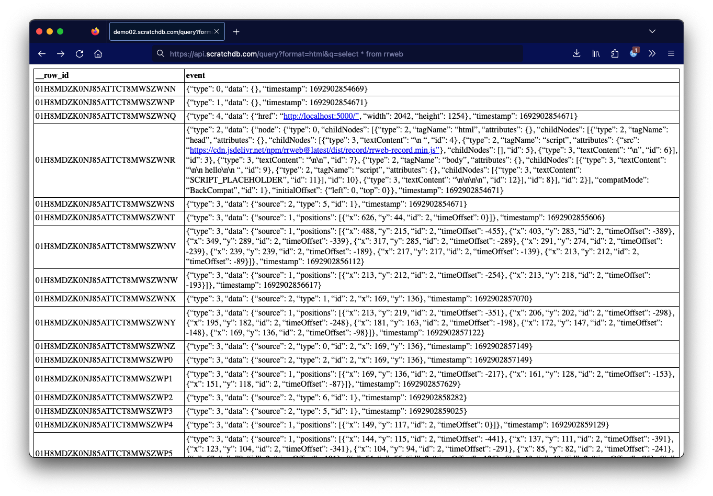

I recently learned about [rrweb](https://www.rrweb.io/), which is a javascript library that
lets you do browser screen recording and playback. It's really nifty and easy to set up.

the rrweb library works by first capturing all visible elements of the DOM. Then it captures changes in mouse movement and DOM elements as "keyframes" which can be played back. There's some light explanation on this HN [thread](https://news.ycombinator.com/item?id=32658825) we well.

This blog post shows how to *save* those sessions into Clickhouse using Scratch.

## Frontend

This code was taken directly from their [documentation](https://github.com/rrweb-io/rrweb/blob/master/guide.md):

``` html
  <script src="https://cdn.jsdelivr.net/npm/rrweb@latest/dist/record/rrweb-record.min.js"></script>
  <script>
    let events = [];

    rrwebRecord({
      emit(event) {
        events.push(event);
      },
    });

    // this function will send events to the backend and reset the events array
    function save() {
      const body = JSON.stringify({ events });
      events = [];
      fetch('/record', {
        method: 'POST',
        headers: {
          'Content-Type': 'application/json',
        },
        body,
      });
    }

    // save events every 10 seconds
    setInterval(save, 10 * 1000);
  </script>
```

This captures data and appends keyframes to an array on the client. Then, every 10 seconds, we ship that data to the server.

## Backend

On the backend, we make a POST request directly to Scratch. Scratch will automatically create tables and columns when new data is inserted.

``` python
@app.post('/record')
def record():
    rc = requests.post(
        'https://api.scratchdb.com/data?table=rrweb', 
        headers={'X-API-KEY': 'API_KEY'}, 
        json=[{'event': json.dumps(e)} for e in request.json['events']]
    )
    return 'ok'
```

## View Raw Data

To see our events, we can use Scratch as a JSON API:

```
$ curl https://api.scratchdb.com/query?q=select * from rrweb
```



## Replay

To replay the screenshot, we just need a few more lines of js:

``` html
  <script>
    // JSON is embedded here, could use a fetch request as well.
    let events = {{ events | safe}};

    new rrwebPlayer({
      target: document.body,
      props: {
        events,
      },
    });
```

On the server, we fetch our replay data and turn it into a JSON array:

``` python
@app.get('/replay')
def replay():
    events = requests.get(
        "https://api.scratchdb.com/query?q=select event from rrweb order by JSONExtractUInt(event, 'timestamp') asc", 
        headers={'X-API-KEY': 'API_KEY'}).json()
    rc = "[" + ",".join([e['event'] for e in events]) + "]"
    return render_template('replay.html', events=rc)
```

## Conclusion

With just a few lines of code - with rrweb and scratchdb doing the heavy lifting - it's easy to do screen
recording. Scratch makes it easy to just "throw the data somewhere" without having to think about where, or how, 
to keep a streaming data store.
