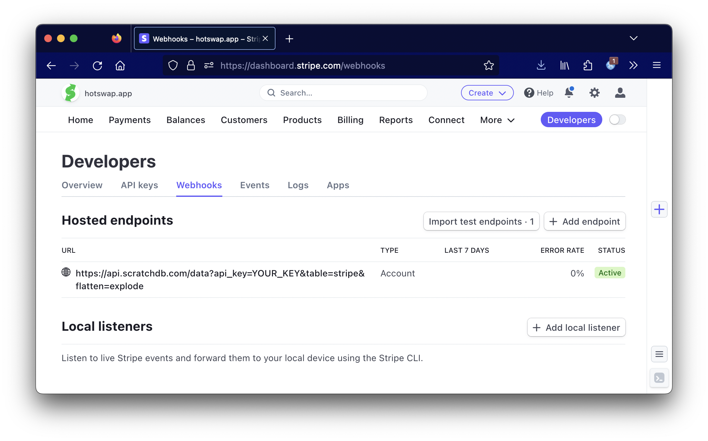

It's difficult to get granular transaction data out of Stripe. And many integrations don't 
let you export every field for analysis. With ScratchDB, you can set up a single webhook
to export all data for all fields and all transactions to a data warehouse.

By pasting in a single webhook URL, we will automatically create database tables
and insert Stripe activity.


## How do I set up Stripe webhooks?

Go to Developers -> Webhooks, and then "Add Endpoint".

From there, enter the following URL:

``` bash
https://api.scratchdb.com/data?api_key=YOUR_KEY&table=stripe&flatten=explode
```

Finally, select the events you want to listen to. The easiest thing is to select
all events. In SQL, you can then filter by the `type` field.

After you save, the settings will look like this:


## How do I query data?

The easiest way to get started is via a REST API. You can also query directly using Clickhouse,
Postgres, or MySQL database connectors.

``` bash
https://api.scratchdb.com/query?q=select * from stripe&api_key=YOUR_KEY
```

The output looks like this:

``` json
[
  {
    "data_object_amount": "2000",
    "data_object_shipping_address_line2": "null",
    "data_object_payment_method_details_card_exp_month": "",
    ...etc...
  }
]
```

## What is ScratchDB?

[ScratchDB](https://github.com/scratchdata/ScratchDB) is an open-source 
data warehouse. It completely simplifies the process of ingesting data and
managing servers.

You can send any JSON you want and we automatically create tables based on
what you've sent.

## Conclusion and Advertisement

ScratchDB is aimed at making it easy to do the simplest thing: capture data so to analyze 
later. This example shows how, with a simple webhook, we can have a full Stripe integration
into our data warehouse and analyze all financial transactions using SQL.
